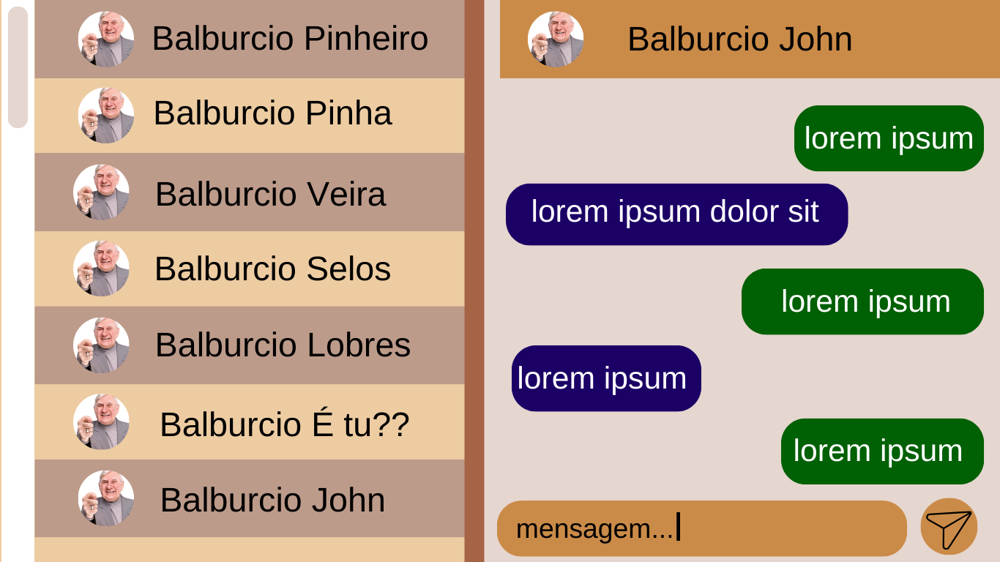

# Vinera

### Descrição:
Este projeto foi desenvolvido para a disciplina de Análise de Sistemas, para o curso técnico em informática, sua proposta é ser uma rede social feita para pessoas de 60 anos ou mais, facilitando seu uso e acesso. 
  
O nome do projeto "Vinera" é originário da mistura das palavras em inglês "Vintage Era", sendo um nome simples e fácil de se memorizar e que faz referência à moda antiga. Vinera tem como objetivo tornar a rede social mais acessível e de fácil uso ao idoso, com interface clara e sem grande poluição de informações, já que é muito recorrente idosos terem grande dificuldade com tecnologias atuais.

## Ficha Ténica:

Desenvolvedores: @eduardahermannalmeida, @leonTurc, @Xenoxys1

Softwares:

## Diagrama (Casos de Uso)

# Mockup

## Menu de Login

### Funcionalidades

- Requisitos não funcionais: ao apertar em "entrar" você sera levado a tela de login do app, ao apertar no botão "criar conta" você sera levado
  a tela de criação de conta, ao apertar no botão "suporte" você sera levado a aba de suporte, se clicado no video de tutorial, você dara começo
  a um video ensinando oque fazer

- Requisitos funcionais: entrar, criar conta, suporte, video tutorial

## Criar Conta

### Funcionalidades

- Requisitos não funcionais: ao apertar em "criar conta" o sistema do app ira processar as informações passadas
  e caso as informações passem pelos requisitos a sua conta sera criada, caso não passe pelos requisitos sua conta não
  sera criada e o sistema ira apontar os problemas de suas informações. ao apertar no botão "suporte" você sera levado
  a aba de suporte, se clicado no video de tutorial, você dara começo a um video ensinando oque fazer

- Requisitos funcionais: criar conta, suporte, video tutorial

## Login

### Funcionalidades

- Requisitos não funcionais:  ao apertar em "entrar" o sistema do app ira processar as informações passadas
  e caso as informações passem pelos requisitos você ira entrar em sua conta, caso não, o sistema apontara o
  problema com as informações passadas. Ao apertar no botão "suporte" você sera levado
  a aba de suporte, ao apertar em "esqueceu sua senha?" você sera levado para a aba de redefinição de senha

- Requisitos funcionais: entrar, suporte, "esqueceu sua senha?"

## Menu Principal

### Funcionalidades

- Requisitos não funcionais: ao apertar em postagens você sera enviado para aba de postagens, ao apertar em televisão/video você sera enviado para aba de televisão/video,
  ao apertar em radio/musica você sera enviado para a aba de radio/musica, ao apertar em culinaria você sera enviado para a aba de culinaria, ao apertar em "meu perfil" você sera enviado para a aba do seu perfil, ao apertar em mensagens você sera enviado para a aba de mensagens e contatos, ao apertar em "amigos" você sera enviado para a aba de amigos onde você podera ver suas amizades do app, ao apertar em noticias você sera enviado para a aba de noticias.

- Requisitos funcionais: postagens, televisão/video, radio/musica, culinaria, meu perfil, mensagens, amigos, noticias

## Perfil

### Funcionalidades:

- Requisitos não funcionais: ao clicar em postar ira aparecer para você uma aba com suas fotos onde podera escolher uma para postar no perfil, ao apertar em mensagens (simbolo de carta) você sera enviado para a aba de mensagens, ao clicar em configurações (simbolo de engrenagem) você sera enviado para a tela de configurações de seu perfil e app

- Requisitos funcionais: postar, mensagens, configurações

## Mensagens

### Funcionalidades:

- Requisitos não funcionais: cada contato é um botão e ao clicar em um contato você sera levado para a conversa com determinado contato. Ao clicar para enviar a mensagem (simbolo de avião de papel) o sistema ira enviar oque você escreveu na area de texto de mensagens para o contato em que se esta conversando. Ao apertar em menu principal você sera enviado de volta ao menu principal.

- Requisitos funcionais: contato, enviar mensagem, menu principal

## Postagens

### Funcionalidades

- Requisitos não funcionais: Ao apertar em menu principal você sera enviado de volta ao menu principal, ao clicar em pesquisar (simbolo de lupa) o sistema ira te mostrar postagens e perfis com as palavras chaves que você colocou na area de texto da pesquisa. Quando clicado na foto de perfil daquele que fez o post, você sera enviado ao perfil da pessoa.

- Requisitos funcionais: menu principal, pesquisar, perfil

## Culinária

### Funcionalidades

- Requisitos não funcionais: Ao apertar em menu principal você sera enviado de volta ao menu principal, ao clicar em pesquisar (simbolo de lupa) o sistema ira te mostrar postagens e perfis com as palavras chaves que você colocou na area de texto da pesquisa. Quando clicado na foto de perfil daquele que fez o post, você sera enviado ao perfil da pessoa.

- Requisitos funcionais: menu principal, pesquisar, perfil

## Notícias

### Funcionalidades

- Requisitos não funcionais: Ao apertar em menu principal você sera enviado de volta ao menu principal, ao clicar em pesquisar (simbolo de lupa) o sistema ira te mostrar postagens e perfis com as palavras chaves que você colocou na area de texto da pesquisa. Quando clicado na foto de perfil daquele que fez o post, você sera enviado ao perfil da pessoa.

- Requisitos funcionais:  menu principal, pesquisar, perfil

## Música

### Funcionalidades

- Requisitos não funcionais: Ao apertar em menu principal você sera enviado de volta ao menu principal, ao apertar em radio você sera enviado para o radio, ao clicar em passar (seta para direita) você ira passar para a proxima musica, se clicar em voltar (seta para esquerda) você ira voltar a musica anterior, ao clicar em pesquisar (simbolo de lupa) o sistema ira te mostrar postagens e perfis com as palavras chaves que você colocou na area de texto da pesquisa.

- Requisitos funcionais:  menu principal, radio, passar, voltar, pesquisar

## Rádio

### Funcionalidades

- Requisitos não funcionais: Ao apertar em menu principal você sera enviado de volta ao menu principal, ao apertar em musica você sera enviado para a parte de musica, ao clicar em estação anterior você ira voltar a estação anterior, ao clicar em proxima estação você ira passar para proxima estação.

- Requisitos funcionais: menu principal, musica, estação anterior, proxima estação

